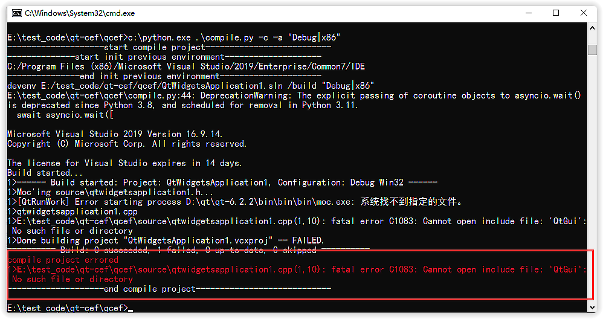
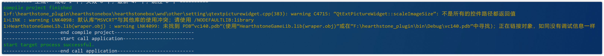

# worktool
## 工作用到的小工具集合

## 1、monkey

主要是为了修改VC Project rc文件的版本号

1.使用方法

  A.运行软件到你的Project的顶层目录，monkey会自动递归查找项目下的rc文件。

  B.然后加载rc文件，获取版本号，在table里modify一栏写入新的版本号

  C.最后点击Modify按钮就会自动更新rc文件的版本号

2.本软件采用VS 2013 + Qt5.6.3版本作为开发集成环境。

## 2、dolphin 

主要是为了查看dll，exe的详细信息，比如：签名，文件名，大小，等等

## 3、cattle

主要是为了解决，在git commit如果提交了中文注释，再使用git 生成的patch文件中
文件里面的中文注释会乱码。

所以通过将所有的commit提交记录导出，并和所有的patch根据commit-id对应起来，
并找到对应的patch文件

将git中所有的commit log导入到桌面commit csv文件中

> git log --date=iso --pretty=format:'"%h","%an","%ad","%s"'>> ~/Desktop/commit.csv

将当前commit id 之前的所有的commit生成patch文件

> git format-patch commit_id

### 使用方法

1.将导出的commit.csv文件和导出的patch文件放到exe当面目录下。

2.点击commit log表格，根据commit ID找到对应的patch file，并补充patch table的内容

3.双击表格的单元格，就会用使用tortoise diff工具打开patch文件，前提是你装了tortoise

工具。如果没有装的，就会使用notepad++打开。否则没有任何操作。


## 4、compile.py

### 1.目的

这个脚本的主要目的就是能够在命令行自动编译程序，杀掉程序，启动程序，更新代码。
可以帮我节省几分钟的时间。剩下的这几分钟时间，可以让我思考刚才的修改的代码有没有问题。
这个脚本通过`config.json`配置一些属性

| 支持功能               |
| ---------------------- |
| 命令行自动编译程序     |
| 杀掉程序               |
| 启动程序               |
| 更新代码               |
| 支持命令行字体颜色高亮 |
| 支持编译错误和警告识别 |

### 2.安装

需要使用pip install命令就可以安装组件

| 安装组件   |
| :--------- |
| psutil     |
| subprocess |
| colorama   |
| asyncio    |

### 3.用法

#### 3.1 命令选项

```bat
PS D:\code>.\compile.py -h
usage: compile.py [-h] [-u] [-pre] [-k] [-s] [-c] [-a COMPILEARGS] [-p CONFIGPATH]

Tools for auto update code and compile project

optional arguments:
  -h, --help            show this help message and exit
  -u, --update          update code by svn or git
  -pre, --precompileaction
                        build code previous action,for example Qt qrc file.
  -k, --kill            kill target process
  -s, --start           start target process
  -c, --compile         compile project
  -a COMPILEARGS, --compileargs COMPILEARGS
                        compile project with args, for example:"Debug|Win32" or "Release|Win32". default value: "Debug|Win32"
  -p CONFIGPATH, --configpath CONFIGPATH
                        load config json path
  -r, --rebuild         rebuild solution
```

#### 3.2 config.json配置文件

**config.json  **配置文件可以在命令行指定，默认就是当前的路径下（**里面的注释需要删除**）

```json
{
	# 进程的名称
	"process_name":"demo.exe",
	# 更新代码的命令,比如: git pull origin master
	"update_code_command":"svn up",
	# 编译之前的动作，因为使用的是Qt，所以需要先编译资源，可以放到bat文件执行
	"pre_compile_command":"E:\xxx.bat",
	# 解决方案的名称
	"compile_file":"D:/code/Demo.sln",
	# IDE的路径，这样就不用修改系统环境变量
	"compile_tool_dir":"C:/Program Files (x86)/Microsoft Visual Studio 12.0/Common7/IDE",
	# 启动进程的路径
	"start_process_path":"D:/code/bin/Debug/Demo.exe",
	# 启动进程的参数
	"start_process_args":["-enable", "-start"]
}
```

#### 3.3 编译错误提示





### TODO list:

- [x] 未能识别编译错误，给出提示
- [x] build resource 不能叫着名字，给人造成歧义
- [x] 增加编译warning提示
- [x] 在中断编译的时候，发现devenv 没有退出，导致再编译的时候发现文件被占用，编译失败


### Tips:

#### compile.py脚本

1.关于脚本中的--compileargs参数，其实就在如下图的一行中，比如这里的就是"Debug|x86"


## 5、 RoundImage

### 1.目的

在写公众号的过程中，经常需要用到图片，但是为了达到好看的效果，就把图片做成圆角带阴影的效果。
所以就写了个小工具转换。


### 2.使用方法

开箱即用，把想修改的图片直接拖拽到窗口上就可以了。

**不要使用管理员权限打开application**

### 3.TODO list:

- [ ] 1、增加菜单功能
- [ ] 2、增加截图功能
- [ ] 3、增加获取网络图片
